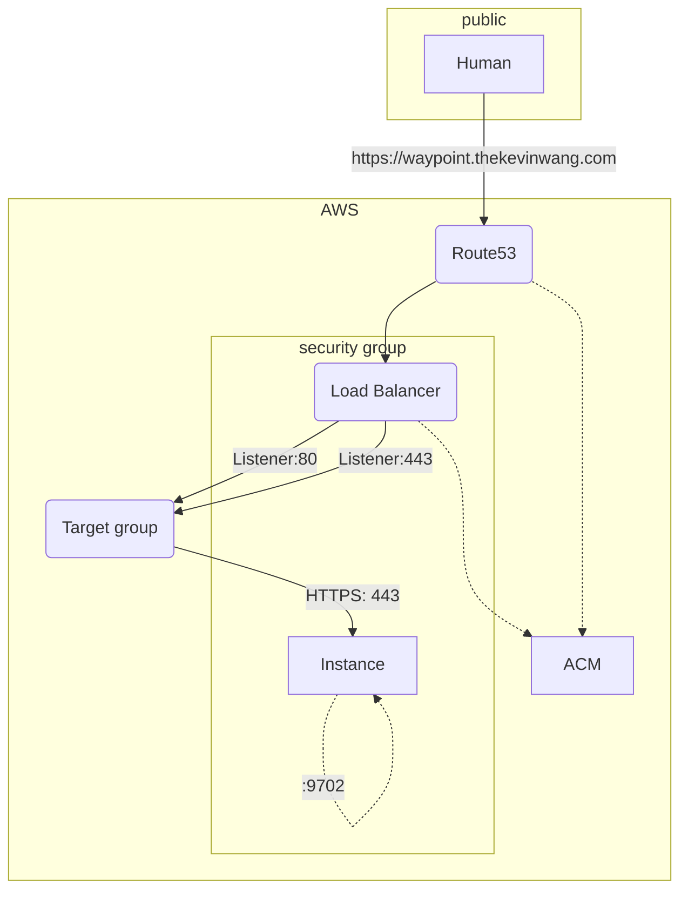

<Note type="warning" fill>
  This section is under construction.
</Note>

Amazon Elastic Compute Cloud, affectionately referred
to as **"EC2"**, is AWS’s virtual compute offering.

If you need a machine other than your personal computer
to run some tasks on, but don’t want to deal with hardware,
then EC2 is one of several options.

Digital Ocean would be another option.

# Launching an instance

It’s fairly easy to launch an instance through the AWS console.

## Instance type

Instance type is important to specify appropriately as it
directly impacts how performant the cloud machine will be
as well how much money will be burned per hour.

`t2.micro` (linux) = 0.0116 USD per hour, which equates to
about $8.50 per month.

> **Warning**
> Let’s say you run a `c3.4xlarge` instance by accident.
> That will be 0.84 USD per hour, which is about $613 per month. ☠️

## Key pair (login)

Create an `RSA` encrypted, `.pem` formatted key pair
used for SSH-ing into the instance.

The console provides a few helpful instructions.

```bash
# ensure your key is not publicly viewable
chmod 400 test_ec2.pem

# Connect to your instance using its Public DNS
ssh -i Downloads/test_ec2.pem ec2-user@ec2-??-???-???-??.compute-1.amazonaws.com
```

## Network settings

AWS networking always leaves me feeling lost and inadequate.
I’ll report back here when I learn more.

The one important setting to check is:

- [x] Allow SSH traffic from `0.0.0.0/0`.

Though this is not the most secure, the `.pem` key requirement
serves as reasonable line of defense against bad actors.

### Security groups

A default security group will likely get auto-created upon
instance launch. It’ll be named something like `launch-wizard-2`.

Allowing inbound SSH traffic from `0.0.0.0/0` results in an _inbound rule_ like

| Name | Security group rule ID | IP version | Type | Protocol | Port range | Source    | Description |
| ---- | ---------------------- | ---------- | ---- | -------- | ---------- | --------- | ----------- |
| -    | sgr-0a0000a00aaaa0000  | IPv4       | SSH  | TCP      | 22         | 0.0.0.0/0 | -           |



## Configure storage

No comment

## Advanced details

No comment
