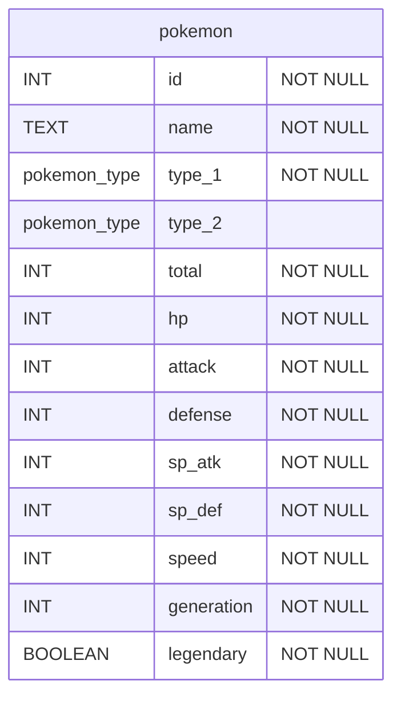

> **Warning**: This section is under construction

# Seeding

Some seeding techniques

## `\copy` from CSV

Here’s a pretty rudimentary example, using `psql` to seed
a Postgres table from a CSV file.

```csv showLineNumbers filename="pokemon.csv"
id,name,type_1,type_2,total,hp,attack,defense,sp_atk,sp_def,speed,generation,legendary
1,Bulbasaur,Grass,Poison,318,45,49,49,65,65,45,1,False
2,Ivysaur,Grass,Poison,405,60,62,63,80,80,60,1,False
3,Venusaur,Grass,Poison,525,80,82,83,100,100,80,1,False
```

Connect to the database...

> **Note**
>
> This is snippet uses `neon` as the host, but the host
> could easily be an AWS RDS instance, or something else.

```bash
psql -h pg.neon.tech
```

Create a custom type/enum...

```sql
-- create pokemon_type enum
DROP TYPE "pokemon_type";
DO $$
BEGIN
    IF NOT EXISTS (SELECT 1 FROM pg_type WHERE typname = 'pokemon_type') THEN
        CREATE TYPE pokemon_type as ENUM(
        'Bug','Dark','Dragon','Electric',
        'Fairy','Fighting','Fire','Flying',
        'Ghost','Grass','Ground','Ice',
        'Normal','Poison','Psychic','Rock','Steel','Water'
        );
		RAISE NOTICE 'enum "pokemon_type" was created';
    ELSE
    	RAISE WARNING 'enum "pokemon_type" already exists';
    END IF;
END
$$;
```

Create table...

```sql
CREATE TABLE pokemon.pokemon (
	id INT NOT NULL,
	name TEXT NOT NULL,
	type_1 pokemon_type NOT NULL,
	type_2 pokemon_type,
	total INT NOT NULL,
	hp INT NOT NULL,
	attack INT NOT NULL,
	defense INT NOT NULL,
	sp_atk INT NOT NULL,
	sp_def INT NOT NULL,
	speed INT NOT NULL,
	generation INT NOT NULL,
	legendary BOOLEAN NOT NULL
);
```



Copy data from CSV...

```bash
# while connected via psql...

# arbitrary bash commands
\! pwd
\! ls
\cd pokemon

\copy pokemon.pokemon FROM './pokemon.csv' DELIMITER ',' CSV HEADER;
```

# Backup and Restore

https://www.postgresql.org/docs/14/backup.html

# Migrations

...

# User Management

...
