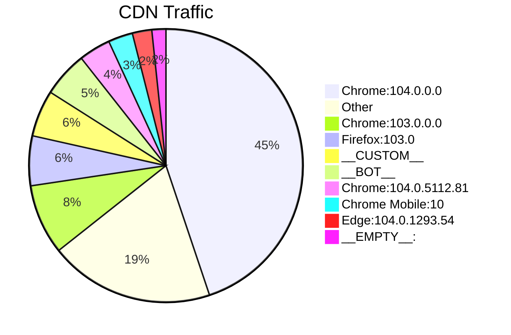

> **Warning**: This section is under construction

# Traffic

Here's the traffic to CloudFront, the CDN that serves my website. This
chart is viewers grouped by browser and version.

Range: `8/12/2022` to `8/19/2022`



# Stack

- https://nextjs.org/
- https://mdxjs.com/blog/v2/
- https://github.com/serverless-nextjs/serverless-next.js
- https://docs.aws.amazon.com/cdk/api/v2/
- https://aws.amazon.com/

## Hacks

```bash showLineNumbers
2022-07-26T15:21:52.126Z 7a4c4448-ae7c-51e6-a205-1f12a6c7d568 INFO wiki/[...slug].tsx getStaticProps error Error [ERR_MODULE_NOT_FOUND]: Cannot find package 'vscode-oniguruma' imported from /Users/kevin/repos/thekevinwang.com/node_modules/@wooorm/starry-night/lib/get-oniguruma.js
at new NodeError (/var/task/chunks/5292.js:37228:5)
at packageResolve (/var/task/chunks/5292.js:38364:9)
at moduleResolve (/var/task/chunks/5292.js:38420:18)
at defaultResolve (/var/task/chunks/5292.js:38458:13)
at resolve (/var/task/chunks/5292.js:38497:12)
at getOniguruma (/var/task/chunks/5292.js:38511:24)
at createOniguruma (/var/task/chunks/5292.js:39040:25)
at createRegistry (/var/task/chunks/5292.js:39010:16)
at createStarryNight (/var/task/chunks/5292.js:38914:31)
at Function.rehypeStarryNight (/var/task/chunks/2387.js:99:64) {
code: 'ERR_MODULE_NOT_FOUND'
}
```

For ISR to work, I need to do this:

```diff filename="./node_modules/@wooorm/starry-night/lib/get-oniguruma.js"
- import fs from 'node:fs/promises'
- import {resolve} from 'import-meta-resolve'

  /** Node w/o fetch. */
  export async function getOniguruma() {
+   return await fetch('https://esm.sh/vscode-oniguruma@1/release/onig.wasm')
-   const pkgUrl = await resolve('vscode-oniguruma', import.meta.url)
-   return fs.readFile(new URL('onig.wasm', pkgUrl))
  }
```

`import.meta.url` evaluates to a local path, that is then shipped to the
regneration lambda function, which obviously doesn't work.

Here is a `postinstall` script to handle the patching from above

```bash filename="./scripts/patch-starry-night.sh"
#!/bin/sh

echo "====================="
echo "Patching Starry Night"
echo "====================="

# A string like `Tue, 02 Aug 2022 22:10:26 +0000`
d=$(date -jRu)

file_to_patch=$(pwd)/node_modules/@wooorm/starry-night/lib/get-oniguruma.js

cat <<EOF > $file_to_patch
// This file has been patched; $d
export async function getOniguruma() {
  return await fetch("https://esm.sh/vscode-oniguruma@1/release/onig.wasm");
}
EOF

# Alternatively, `cat` a file's contents over the file to be patched
# cat $(pwd)/scripts/get-oniguruma.js > $file_to_patch
```
