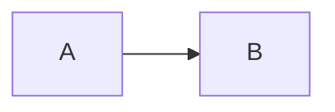
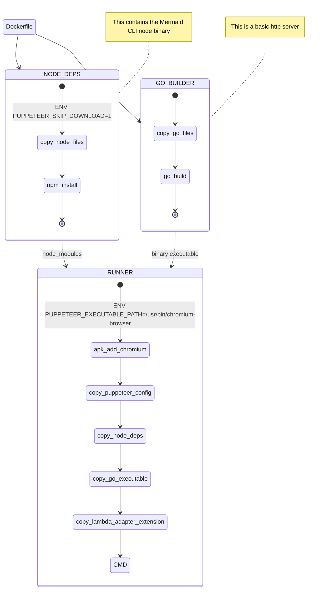
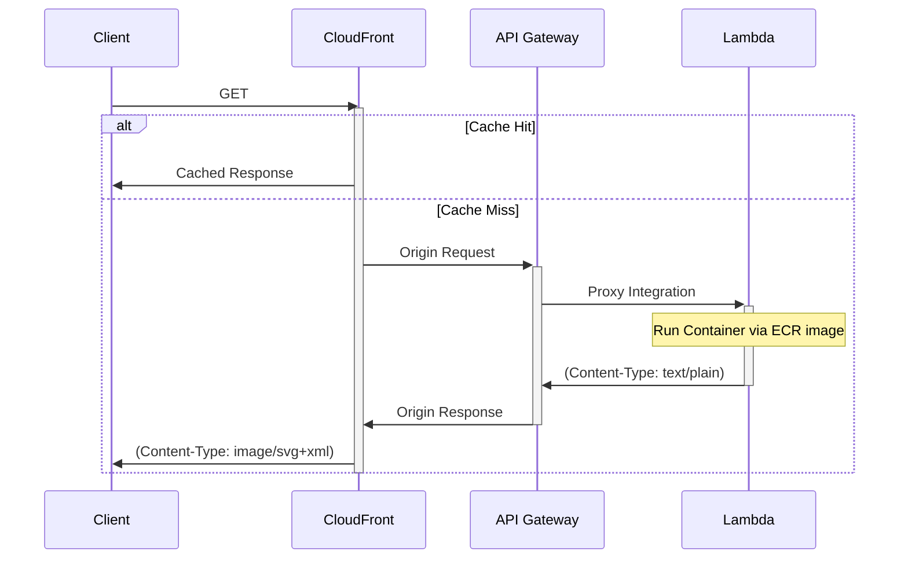

> **Warning**: This section is under construction

# Overview

For this site, I author everything in MDX. Diagrams are written as regular
fenced codeblocks, with `mermaid` as the language.

````markdown

````

The code blocks are rendered as is, and a **client-side request** is made
to `mermaid.thekevinwang.com` with the diagram payload.

The server returns a SVG image:


## Implementation

Behind this, there is a Lambda function, running a Docker container. Here is
an overview of the Dockerfile.



This builds an OCI image, which is hosted on AWS ECR. When Lambda uses this
to run a container, it internally runs a compiled http server, and uses the
Mermaid CLI binary to process incoming diagram text. It returns a simple SVG
string.

The end to end flow looks like this



## Rationale

The same client-side request to generate a mermaid diagram could occur
server-side, but I simply have it client-side because I want to be
able to request an updated diagram SVG, in response to changes in the
client’s `mode` value (dark/default).

### `Content-Type`

I’ve run into some issues with the `Content-Type` header. If I set it
to the _correct_ value — `image/svg+xml` — in Lambda container code,
it either gets automatically base64-encoded by API Gateway, or I get
an XML error.

```markdown
This page contains the following errors:
error on line 1 at column 1: Document is empty
Below is a rendering of the page up to the first error.
```

However, if I call the lambda function's URL directly, it _just works_,
but I don’t get any flexiblity of CDN edge caching, or adding
a fully qualified domain name.

So, my fix was to use edge compute (CloudFront functions) to
modify the `Content-Type` header accordingly. 🧠

## Appendix

Here are some syntax cheatsheets I found to be helpful:

- [General](https://jojozhuang.github.io/tutorial/mermaid-cheat-sheet/) (doesn’t have state diagram snippets though)
- [One with `stateDiagram`](https://coda.io/@leandro-zubrezki/diagrams-and-visualizations-using-mermaid/state-diagram-6)

And of course, the Mermaid live playground

- https://mermaid.live/
