> **Warning**: This section is under construction

# Nix Shell

```bash
nix-shell -p libuuid

# [nix-shell:~/repos/thekevinwang.com]$
```

```bash
uuidgen | tr [:upper:] [:lower:]

# ...some uuid
```

> **Warning**: You need quotes (`'`) if using `zsh`: https://stackoverflow.com/questions/62266314/zsh-no-matches-found-space
>
> ```bash
> uuidgen | tr '[:upper:]' '[:lower:]'
> ```

# Mermaid

https://jojozhuang.github.io/tutorial/mermaid-cheat-sheet/

The top down order in which you define `participants` determines their
left-to-right rendering.

```
sequenceDiagram
    participant GH as GitHub
    participant AE as /api/event
    participant WF as Workflow
    participant AC as /api/content

    GH->>+AE: POST {...Event}
    AE->>+WF: repository_dispatch
    WF->>-AE: 204 No Content
    alt
        AE->>GH: 200 OK
    else
        AE->>GH: 400 Bad Request
    else
        AE->>-GH: 500 Server Error
    end

    WF->>+AC: POST {}
    AC->>-WF: 201 Created

```

```
sequenceDiagram
    participant GH as GitHub
    participant API as API
    participant WF as Workflow
    participant H as Human

    Note over GH: {Push|Create|Release}
    GH->>+API: POST /api/event
    %% Human refreshes GitHub actions UI
    loop Every minute
        H-->>+WF: Status?
    end

    API->>+WF: repository_dispatch
    WF->>-API: 204 No Content


    alt
        API->>GH: 200 OK
    else
        API->>GH: 400 Bad Request
    else
        API->>-GH: 500 Server Error
    end

    WF->>+API: POST /api/content
    Note over WF,API: {Doc|NavData|VersionMetadata}
    API->>-WF: 201 Created


    WF-->>-H: {Pending|Success|Error}

```

https://mermaid.live/edit#pako:eNp1k02P0zAQhv-KZWlPtNpSLZccFsH2IwixW22AXCKhwZluLRI72OOiqul_Zxw3LFDwJXHeJzPvzNhHqWyNMpMevwc0Chcanhy0lRG8OnCkle7AkFjnArxYa8rD10v1zeZdlPlxqZWrKJXWfds29selPgTOQwumMkm9t4TC7tFx1kwcN8Hv-juHQNg_YoPg8ZTAdT69vX3BWTOxeSg-imvo9DXu0VDSr65SYOFw69DvcKxAgCJtjRefzoYbazux5JQH0WoTCNPnuPJpTFKuMlEQUPCvk4SmHv2ygRFx2FmvybrDl1r7DkjtElOuGJkOVuezGy5R3FlDg9MxDDT0nDXFjPXPZzPx8P6ctPH4L-aGmbdQi8c4Rk__h6eRfsV0gS42eOmcdRcFDWb_7qsa_f45onI1GcDjwqr-HvYLIOg_o_Pc3w9IUPP-9HufprFP89lLkUZaP1uMK-1-2Yj8cAbYnTZPfRGUQu_7wTeHlRPZomtB13yIj_G3StIOW6xkxq81biFwW2VlToyGjt3gso4DktkWuEETCYFscTBKZuQCjtD5Ipyp00-Gc_rn

```mermaid
sequenceDiagram
    participant GH as GitHub
    participant DB as Database
    participant API as API
    participant WF as Workflow
    participant H as 🤨

    Note over GH: {Push|Create|Release}
    GH->>+API: POST /api/event
    %% Human refreshes GitHub actions UI
    loop Every minute
        H-->>+WF: Status?
    end

    API->>+WF: repository_dispatch
    WF->>-API: 204 No Content

    %% status update
    %% not important to show
    WF-->>H: {Pending}

    API->>-GH: 200 OK

    loop for each document
        WF->>+API: POST /api/content
        API->>+DB: write
        %% status update
        %% not important to show
        WF-->>H: {Pending}
        DB->>-API: OK
        API->>-WF: 201 Created
    end


    WF-->>-H: {Success|Error}
```



https://mermaid.live/edit#pako:eNqFU8uO0zAU_ZUrS7NioikVqywG0UkfCImpKKibSOiOczuxSOxgX8-oavstbFjweXwCdh5VoAjuJlHO0T0PxwchTUEiFY6-etKSMoWPFutcQ5gGLSupGtQMyxWgg6XilX-4RLNZRDNkfEBHl_ib9dtICI9LbLuI0NbYL7vKPF_irfDPb99_5LoD3xsmME9kg6kUDmvvyuOdJWQ6fqCKgoFTR1yuktvbF0E0hfX95iPcYKNu6Ik0d_jVFax8jRos7Sy5koaAgJKV0Q4-9X4rYxqYB8k91Ep77iPGWSVRZLtIYcPI3r3uINLF4DcYGCiWGuMUG7v_XCjXIMuy42wXgZK0VqeTVyEi3BnNrdOzV9fuB98UOBgIX7VhUHVjLMey2IArhxbD0rC17SjYUfqx72VsK4kdTicTuH83SLVhd8YCoSyhMNLX58rOXv-sVQ52B1afOpul8GzVuLG_R_l_nH9FipPNzh3GML8bSWL908lL6P6UYnRKMJpxQZ1WEsU2Xkpy7ji31tggKa5FTbZGVYS7c4j0XHBJNeUiDa8F7dBXnItcnwK1izkv4sGLdIeVo2uBns1mr6VI2XoaSP3961mnX8FrHWE
