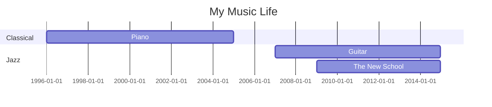

> **Warning**: This section is under construction

I grew up playing classical piano since I was about 5. It’s a pretty
standard move for asian parents raising children in the 90’s.
I hated it to be honest... but am very grateful for the skills that
it helped me develop. Of the skills, _“how to learn”_ is the most
important.

# Classical

- Fundamental theory
- Practice Routine
- Memorization
- Taking Exams
- Ladder

# Jazz

TODO:

- How to play by the rules
- There are a fuck ton of wrong notes...
- How to break the rules
- How to play with conviction
- The New York scene
  - The Good
  - The Bad
  - The Ugly

# What I Listen To
