> **Warning**: This section is under construction

# Testing Changes

The way I go about testing changes in `hashicorp/waypoint` is by building
and publishing the server and runner Docker images. This allows pods in a
Kubernetes cluster to pull down and use them.

```mermaid
%% using GitHub container registry
graph TD
    Human("🙋‍♂️")
    DL["docker auth"]
    Human --"hashicorp/waypoint"--> MDS["build docker images"]
    Human -."
        echo $(get_ghcr_token) | \<br/>
         docker login ghcr.io -u thiskevinwang --password-stdin
    ".->DL-.->Human

    MDS --"
        make docker/server
    "--> Tag["tag docker images"]

    Tag --"
        docker tag waypoint:dev ghcr.io/thiskevinwang/waypoint:latest
        <br/>
        docker tag waypoint-odr:dev ghcr.io/thiskevinwang/waypoint-odr:latest
    "--> Push["push docker images"]

    Push --"
        docker push ghcr.io/thiskevinwang/waypoint:latest
        <br/>
        docker push ghcr.io/thiskevinwang/waypoint-odr:latest
    "--> US["upgrade waypoint server"]
```



## Wipe the server

This helps to start fresh, and only takes about a minute to run.

```bash
helm uninstall waypoint

# sts may be what makes deleted pods keep recreating themselves
kubectl delete sts waypoint-server
kubectl delete sts waypoint-static-runner
kubectl delete pvc data-default-waypoint-server-0
kubectl delete pvc data-default-waypoint-static-runner-0
kubectl delete svc waypoint
kubectl delete deploy waypoint-runner

kubectl delete rolebinding waypoint-bootstrap-rolebinding
kubectl delete rolebinding waypoint-runner-rolebinding
kubectl delete rolebinding waypoint-static-runner-odr-rolebinding-edit
kubectl delete rolebinding waypoint-static-runner-rolebinding

kubectl delete serviceaccount waypoint
kubectl delete serviceaccount waypoint-bootstrap
kubectl delete serviceaccount waypoint-runner
kubectl delete serviceaccount waypoint-runner-odr

kubectl delete clusterrole waypoint-static-runner-odr
# DANGEROUS
k delete secret -l owner=helm
```

## Install Waypoint

```bash
waypoint server install \
  -accept-tos \
  -platform=kubernetes \
  -k8s-server-image=ghcr.io/thiskevinwang/waypoint:latest \
  -k8s-odr-image=ghcr.io/thiskevinwang/waypoint-odr:latest
```

## Configure project

This step configures the project to use a remote GitHub config.

```bash
waypoint project apply \
  -data-source=git \
  -git-url=https://github.com/thiskevinwang/waypoint-web-lambda.git \
  -git-path=go/gin \
  -git-ref=refs/heads/waypoint-terraform-hook \
  go
```
